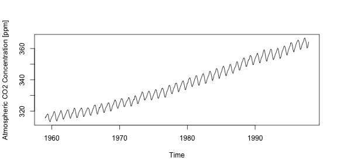
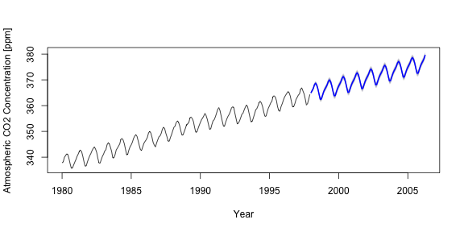

## Forecasting

+ "Forecasting is about predicting the future as accurately as possible, given all of the information available, including historical data and knowledge of any future events that might impact the forecasts." - <a href="https://www.otexts.org/fpp/1/2">Forecasting: principles and practice</a>
+ It is an active area of research.
    + Telecommunications 
    + Space Weather
    + Power Generation
    + Scheduling
    + Capital Investments
    + Production Lines
    + Many more...

---

## Mauna Loa Atmospheric CO2 Concentration Data

+ The data contains atmospheric concentrations of CO2 expressed in parts per million [ppm].
+ It is a time series with 468 observations taken monthly from 1959 to 1997.
+ For more information, check <a href="https://stat.ethz.ch/R-manual/R-devel/library/datasets/html/co2.html">here</a>.


```r
plot(co2, ylab = "Atmospheric CO2 Concentration [ppm]")
```

 

--- 

## ARIMA models

+ ARIMA stands for AutoRegressive Integrated Moving Average.
+ ARIMA models can be written as:

$$\begin{equation}y'_{t} = c +
\phi_{1}y'_{t-1} + \cdots + \phi_{p}y'_{t-p} +
\theta_{1}e_{t-1} + \cdots + \theta_{q}e_{t-q} + e_{t}
\end{equation}$$

where $y_{t}$ is a value of the time series at time $t$, $y'_{t}$ is the differenced series, $e_{t}$ is the error at time $t$, $p$ is the order of the autoregressive part, and $q$ order of the moving average part.

+ The coefficients $\phi_{1},\cdots,\phi_{p}$, $\theta_{1},\cdots,\theta_{q}$ and the values of $p$ and $q$, are unknowns and need to be identified.

--- 

## The Shiny App

+ The developed shiny app fits an ARIMA model on the atmospheric CO2 concentration data, where the user can specify the start year of the time series.
+ The shiny app plots the time series together with future predictions, where the horizon is specified by the user.


```r
library(forecast)
fit <- auto.arima(window(co2, start = 1980))
plot(forecast(fit, h = 100), xlab = "Year", ylab = "Atmospheric CO2 Concentration [ppm]", main = "")
```

 
